# Monexo v2
---

### Monexo is financas application help you to manage and tracking your consuming, incoming, expern, financas goals, saving box and more
---

## Features 🐱‍💻:

- Login & Registertion 
- powerful statistics
- Transactions tracker
- User log show all actions of user in application
- Saving boxs 
- future goals
- Finances content (Books & Videos)
- Manage profile
- Monexo ai assistant
- Android application


----

## installing & run ⚡

1- install dependencies of laravel

```bash
composer install
```

2- run the migration

```bash
php artisan migrate
```

3- run the application

```bash
php artisan serve
```


---
## Overview 📸✨


### Monexo login
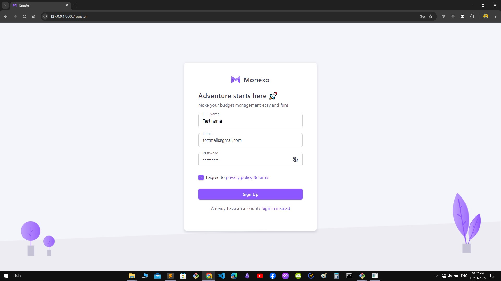

### Dashboard
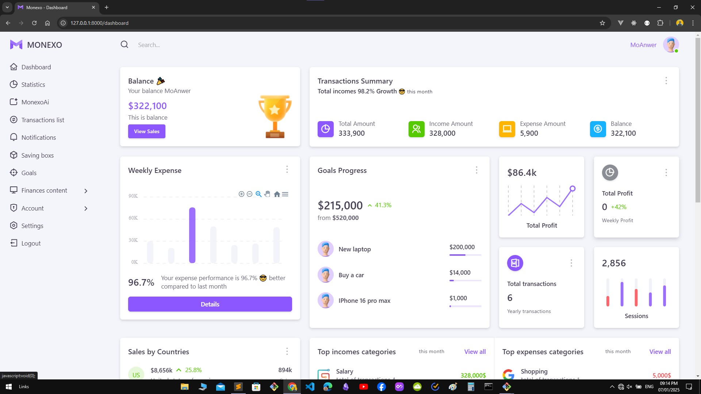

### Profile
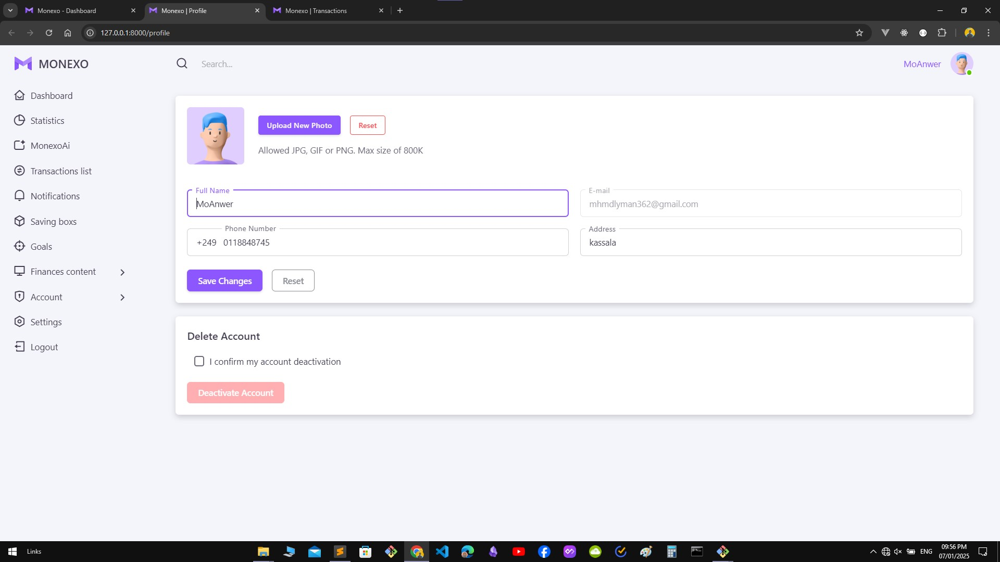

### Monexo ai chat
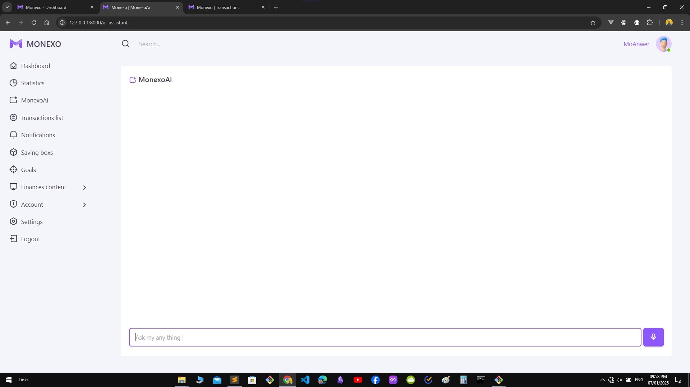

### Transcations form
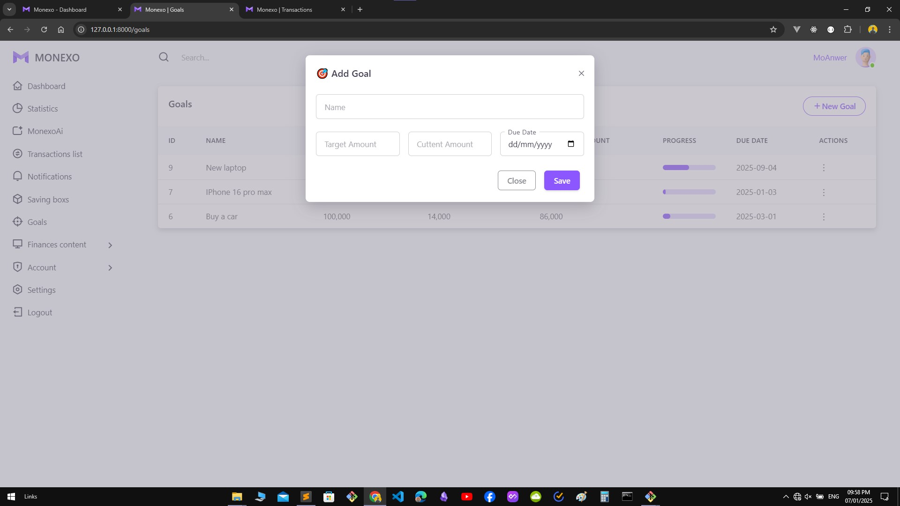

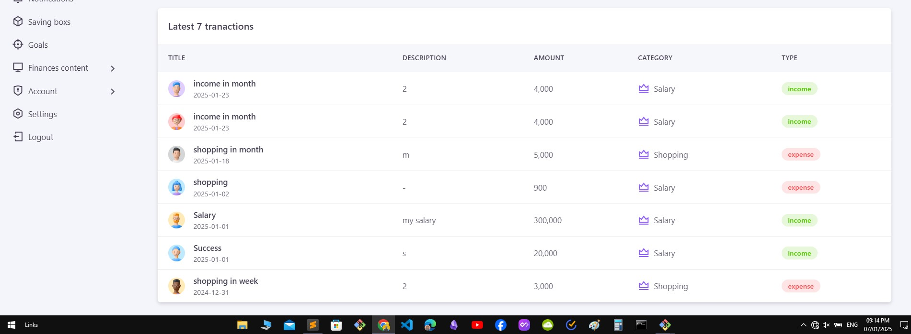
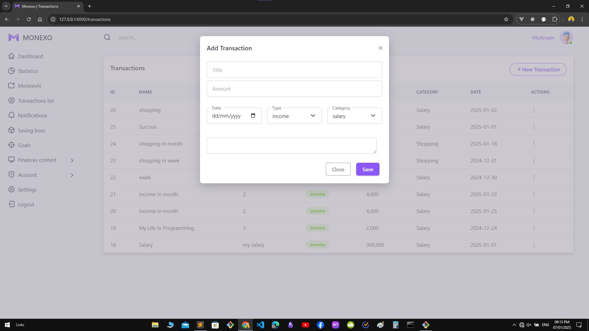
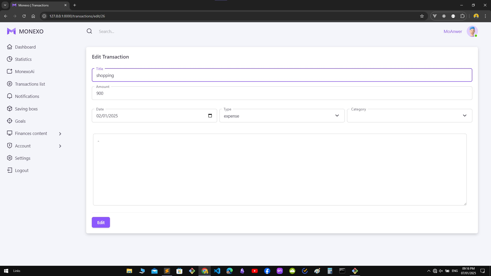
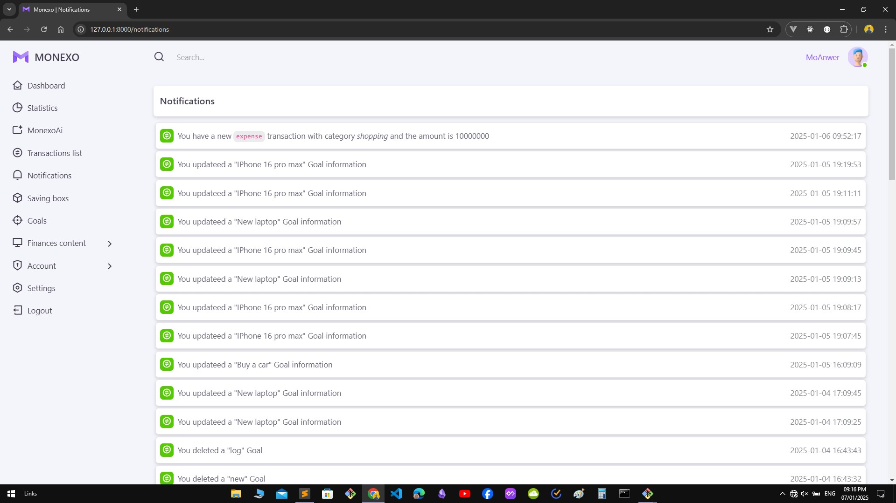
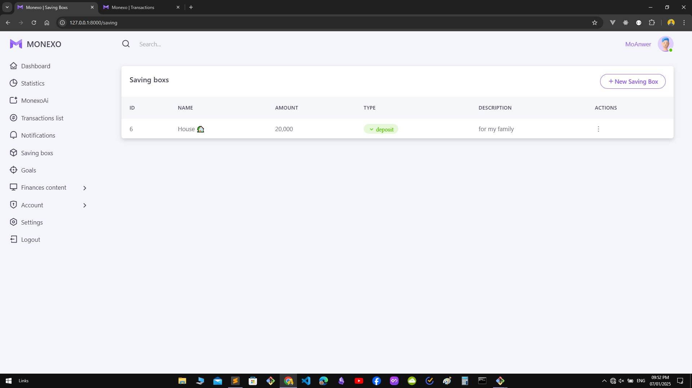
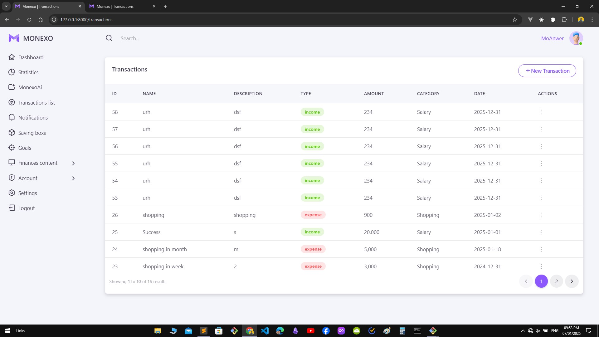
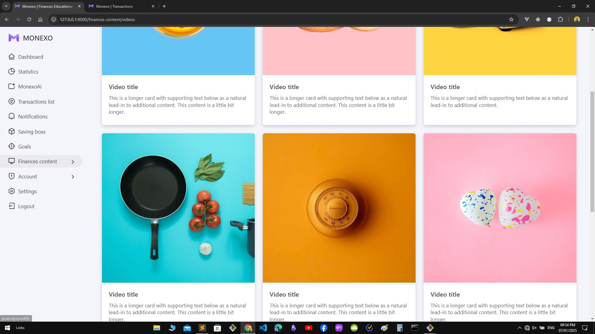
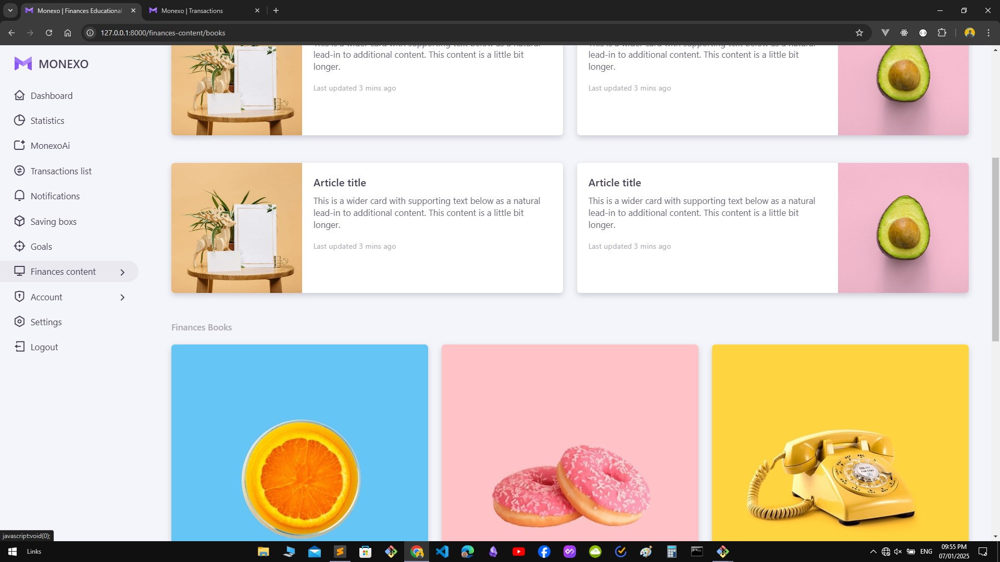

## application 


---

this template designed by [themeselection](https://themeselection.com/)

--- 

Made with 💝 by Mohamed Anwer